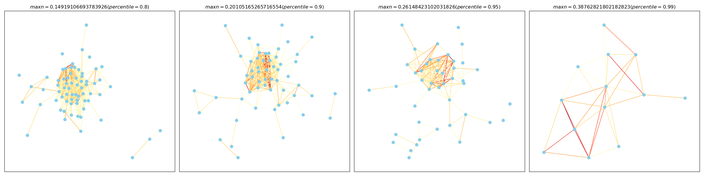
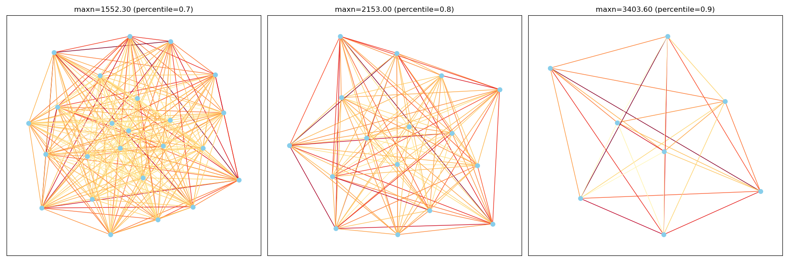
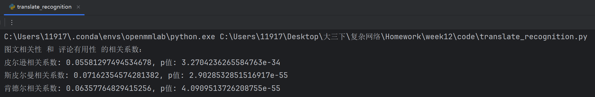

# 21377062-王悦扬-week12-网络

## 1.环境配置

### 1.1 mmdetection

#### 1.1.1 安装

```bash
git clone https://github.com/open-mmlab/mmdetection.git
```

#### 1.1.2 配置环境

​	根据官方文档https://mmdetection.readthedocs.io/zh-cn/latest/get_started.html配置对应环境

1.1.3 检测GPU可用性

​	torch_available.py

```python
import torch
if torch.cuda.is_available():
    print(torch.cuda.device_count())
    print(torch.cuda.get_device_name(0))
else:
    print("CUDA is not available.")
```

## 2.图像物体检测

### 2.1 识别已有json结构

​	parse_json.py

```python
import json

# 定义读取和写入文件路径的列表
read_json_paths = [
    'comment_data/target_comment_seed2021.json',
    'comment_data/target_comment_no_image.json',
    'comment_data/20220128sample_comment.json',
]
write_json_paths = [
    'result/data/target_comment_seed2021.json',
    'result/data/target_comment_no_image.json',
    'result/data/20220128sample_comment.json',
]

# 循环处理每个文件
for read_path, write_path in zip(read_json_paths, write_json_paths):
    with open(read_path, 'r', encoding='utf-8') as file:
        data = json.load(file)

        # 处理字典中的每个键，每个键的值也是一个字典
        subset = {}
        for key, nested_dict in data.items():
            if isinstance(nested_dict, dict):
                # 选取嵌套字典中的前三个键值对
                selected_items = list(nested_dict.items())[:3]
                subset[key] = dict(selected_items)
            else:
                # 如果不是字典，则直接保留原始值
                subset[key] = nested_dict

    with open(write_path, 'w', encoding='utf-8') as outfile:
        json.dump(subset, outfile, indent=4, ensure_ascii=False)

```

​	处理后的结果：

​	target_comment_seed2021.json

```json
{
    "topped": {
        "0": 0,
        "1": 0,
        "2": 0
    },
    "referenceTime": {
        "0": 1470690470000,
        "1": 1511198428000,
        "2": 1481116233000
    },
    "userLevelName": {
        "0": "钻石会员",
        "1": "PLUS会员",
        "2": "钻石会员"
    },
    "userProvince": {
        "0": "",
        "1": "",
        "2": ""
    },
```

### 2.2 处理图像数据

​	inference.py

```python
import os
import pickle
import random
from mmdet.apis import DetInferencer
from tqdm import tqdm

# random.seed(3407)

def pickle_dump(obj, filename):
    with open(filename, 'wb') as f:
        pickle.dump(obj, f)

def is_png(filename):    # 禁用png检测，因为存在一些png错误
    png_magic_number = b'\x89PNG\r\n\x1a\n'
    with open(filename, 'rb') as f:
        file_header = f.read(8)
    return file_header == png_magic_number

def is_jpg(filename):
    jpg_magic_number = b'\xff\xd8\xff'
    with open(filename, 'rb') as f:
        file_header = f.read(3)
    return file_header == jpg_magic_number

# 配置文件和检查点文件路径
config_file = 'code/rtmdet_tiny_8xb32-300e_coco.py'
checkpoint_file = 'code/rtmdet_tiny_8xb32-300e_coco_20220902_112414-78e30dcc.pth'

if __name__ == '__main__':
    # 创建推理器
    inferencer = DetInferencer(model=config_file,
                               weights=checkpoint_file,
                               device='cuda:0',
                               show_progress=True,)

    folder_dirs = []
    for i in range(1, 6):
        folder_dirs.append(f"./jd_comment_picture/pic_computer/{i}")
        folder_dirs.append(f"./jd_comment_picture/pic_data_high_pix/{i}")
        folder_dirs.append(f"./jd_comment_picture/pic_data_high_pix_downsample/{i}")

    img_path_dict = {}
    input_images = []
    for folder in folder_dirs:
        for item_id in os.listdir(folder):
            item_folder = f"{folder}/{item_id}"
            for comment_id in os.listdir(item_folder):
                comment_folder = f"{item_folder}/{comment_id}"
                for picture_name in os.listdir(comment_folder):
                    picture_dir = f"{comment_folder}/{picture_name}"
                    if is_jpg(picture_dir):
                        input_images.append(picture_dir)
                        img_path_dict[picture_dir] = (item_id, comment_id)

    # # 随机选择 5000 张图片
    # if len(input_images) > 5000:
    #     input_images = random.sample(input_images, 5000)
    pickle_dump(img_path_dict, 'img_path_dict.pkl')
    pickle_dump(input_images, 'input_image_dir_list.pkl')
    print(f"Valid Pictures: {len(input_images)}")

    all_results = []
    batch_size = 1000

    # 执行推理，按批处理，防止调度过大
    prog = tqdm(total=(len(input_images)+batch_size-1)//batch_size, desc="Batch Inference")
    for i in range((len(input_images)+batch_size-1)//batch_size):
        cur_batch_start = i * batch_size
        cur_batch_end = (i + 1) * batch_size
        result = inferencer(inputs=input_images[cur_batch_start:cur_batch_end],
                            out_dir='',
                            return_vis=False,
                            no_save_vis=True,
                            no_save_pred=True)
        for img_result in result['predictions']:
            all_results.append([])
            for score, label in zip(img_result['scores'], img_result['labels']):
                all_results[-1].append([score, label])
        if os.path.exists(f'all_results_{i-1}.pkl'):
            os.remove(f'all_results_{i-1}.pkl')
        pickle_dump(all_results, f'all_results_{i}.pkl')
        prog.update(1)

```

### 2.3 提取并保存模型的类别信息

​	extract_word_class.py

```python
import json

import torch

# 加载模型权重文件
checkpoint = torch.load('code/rtmdet_tiny_8xb32-300e_coco_20220902_112414-78e30dcc.pth', map_location='cpu')

with open("all_classes.json", 'w', encoding='utf-8') as f:
    json.dump(checkpoint['meta']['dataset_meta']['CLASSES'], f)

```

### 2.4 推理结果分类

​	extract_inference_result.py

```python
import json
import pickle
from tqdm import tqdm


def load_pickle(path):
    with open(path, 'rb') as f:
        return pickle.load(f)


with open("all_classes.json", 'r', encoding='utf-8') as f:
    id_to_class = json.load(f)


if __name__ == '__main__':
    score_threshold = 0.25

    imgdict = load_pickle("img_path_dict.pkl")
    images = load_pickle("input_image_dir_list.pkl")
    inferences = load_pickle("all_results_113.pkl")

    output_result = {}

    progbar = tqdm(total=len(images))

    for image, inference in zip(images, inferences):
        progbar.update(1)
        current_picture_items = set()
        for raw_score, raw_label in inference:
            if raw_score >= score_threshold:
                current_picture_items.add(raw_label)
        item_id, comment_id = imgdict[image]
        if item_id not in output_result:
            output_result[item_id] = {}
        if comment_id not in output_result[item_id]:
            output_result[item_id][comment_id] = set()
        for i in current_picture_items:
            output_result[item_id][comment_id].add(i)

    for item_id in output_result.keys():
        for comment_id in output_result[item_id].keys():
            output_result[item_id][comment_id] = list(map(lambda x: id_to_class[x],
                                                      list(output_result[item_id][comment_id])))
    with open("infer_result.json", 'w', encoding='utf-8') as f:
        json.dump(output_result, f, indent=4)

```

### 2.5 结果展示

​	infer_result.json

```json
{
    "100000115602": {
        "12572773928": [
            "keyboard",
            "baseball bat"
        ],
        "12440685843": [
            "person",
            "remote",
            "baseball bat",
            "cell phone",
            "sink",
            "bottle",
            "book",
            "cup",
            "scissors",
            "toothbrush",
            "toilet",
            "laptop"
        ],
        "12588072099": [
            "skateboard",
            "scissors",
            "toothbrush"
        ],
        "12728102154": [
            "toothbrush"
        ],
        "12728320184": [
            "knife",
            "toothbrush"
        ],
```

## 3.物体共现网络

### 3.1 代码

​	co_occurence.py

```python
import json
import networkx as nx
import matplotlib.pyplot as plt
import matplotlib.colors as mcolors
import numpy as np
import os

def draw_graphs_combined(g, thresholds, titles, filename):
    fig, axes = plt.subplots(1, len(thresholds), figsize=(len(thresholds)*6, 6))
    for ax, graph, title in zip(axes, g, titles):
        weights = nx.get_edge_attributes(graph, 'weight').values()
        cmap = plt.get_cmap('YlOrRd')
        norm = plt.Normalize(vmin=min(weights), vmax=max(weights))
        edge_colors = [cmap(norm(weight)) for weight in weights]

        pos = nx.kamada_kawai_layout(graph)
        nx.draw_networkx_nodes(graph, pos, node_size=50, node_color='skyblue', ax=ax)
        nx.draw_networkx_edges(graph, pos, edge_color=edge_colors, width=1, ax=ax)
        ax.set_title(title)

    plt.tight_layout()
    os.makedirs(os.path.dirname(filename), exist_ok=True)  # 确保目录存在
    plt.savefig(filename, format='png')
    plt.close(fig)

def draw_node_graphs_combined(g, maxns, titles, filename):
    fig, axes = plt.subplots(1, len(maxns), figsize=(len(maxns)*6, 6))
    for ax, graph, title in zip(axes, g, titles):
        weights = nx.get_edge_attributes(graph, 'weight').values()
        cmap = plt.get_cmap('YlOrRd')
        norm = plt.Normalize(vmin=min(weights), vmax=max(weights))
        edge_colors = [cmap(norm(weight)) for weight in weights]

        pos = nx.kamada_kawai_layout(graph)
        nx.draw_networkx_nodes(graph, pos, node_size=50, node_color='skyblue', ax=ax)
        nx.draw_networkx_edges(graph, pos, edge_color=edge_colors, width=1, ax=ax)
        ax.set_title(title)

    plt.tight_layout()
    os.makedirs(os.path.dirname(filename), exist_ok=True)  # 确保目录存在
    plt.savefig(filename, format='png')
    plt.close(fig)


def remove_graph(g: nx.Graph, quantile_value=0.5):
    G = g.copy()

    # 获取所有边的权重
    weights = np.array([data['weight'] for u, v, data in G.edges(data=True)])

    # 计算所需的分位数值
    threshold = np.quantile(weights, quantile_value)

    # 找出权重小于该分位数的边
    edges_to_remove = [(u, v) for u, v, data in G.edges(data=True) if data['weight'] < threshold]

    # 从图中删除这些边
    G.remove_edges_from(edges_to_remove)

    nodelist = list(G.nodes)
    for node in nodelist:
        if len(list(G.neighbors(node))) == 0:
            G.remove_node(node)

    return G, threshold


if __name__ == '__main__':
    with open("infer_result.json", 'r', encoding='utf-8') as f:
        recognition = json.load(f)

    N = {}
    all_items = []
    for item in recognition:
        for comment in recognition[item]:
            targets = recognition[item][comment]
            for target in targets:
                if target not in N:
                    N[target] = set()
                N[target].add(item)


    accimg = 0
    for u in N.keys():
        for v in N.keys():
            if u != v:
                accimg = max(accimg, len(N[u].intersection(N[v])) / len(N[u].union(N[v])))
    print(accimg)

    g = nx.Graph()
    for detect_obj in N.keys():
        g.add_node(detect_obj)
    for u in N.keys():
        for v in N.keys():
            if u != v:
                g.add_edge(u, v, weight=len(N[u].intersection(N[v])) / len(N[u].union(N[v])))

    # delete edge
    remove_rates = [0.8, 0.9, 0.95, 0.99]
    graphs = []
    thresholds = []
    titles = []
    for remove_rate in remove_rates:
        g_draw, thres = remove_graph(g, remove_rate)
        graphs.append(g_draw)
        thresholds.append(thres)
        titles.append(f"$maxn={thres} (percentile = {remove_rate})$")

    draw_graphs_combined(graphs, thresholds, titles, 'figure/graph_combined.png')

    # delete node
    all_count = [len(i) for i in N.values()]
    quantiles = [0.7, 0.8, 0.9]
    graphs = []
    maxns = []
    titles = []
    for quantile in quantiles:
        maxn = np.quantile(all_count, quantile)
        g2 = nx.Graph()
        for detect_obj in N.keys():
            g2.add_node(detect_obj)
        for u in N.keys():
            for v in N.keys():
                if u != v:
                    g2.add_edge(u, v, weight=len(N[u].intersection(N[v])) / len(N[u].union(N[v])))
        for i in N.keys():
            if len(N[i]) < maxn:
                g2.remove_node(i)
        graphs.append(g2)
        maxns.append(maxn)
        titles.append(f"maxn={maxn:.2f} (percentile={quantile})")

    draw_node_graphs_combined(graphs, maxns, titles, 'figure/graph_node_combined.png')
```

### 3.2 结果





## 4.图文一致性

### 4.1 分析评论

​	comment_json_parse.py

```python
import json

if __name__ == '__main__':
    result = {}
    comment_files = ["comment_data/20220128sample_comment.json",
                     "comment_data/target_comment_no_image.json",
                     "comment_data/target_comment_seed2021.json"]
    for comment_file in comment_files:
        print(f"Processing {comment_file}")
        with open(comment_file, 'r', encoding='utf-8') as f:
            comment = json.load(f)
        if 'pic_path' in comment:
            id_dict = comment['pic_path']
        else:
            print(f"Pic_path not in {comment_file}")
            continue
        for k in id_dict.keys():
            v = id_dict[k].split("\\")
            if len(v) >= 2:
                v = v[-2]
            else:
                v = ''
            id_dict[k] = v
        content_dict = comment['content']
        useful_dict = comment['usefulVoteCount']
        if id_dict.keys() == content_dict.keys():
            for cid, c_comment, c_useful in zip(id_dict.values(), content_dict.values(), useful_dict.values()):
                result[cid] = [c_comment, c_useful]
            print(f"Processed {comment_file}")
        else:
            print(f"Mismatch on {comment_file}")

    with open("comments_all.json", 'w', encoding='utf-8') as f:
        json.dump(result, f)


    with open("infer_result.json", 'r', encoding='utf-8') as f:
        infer = json.load(f)
    for item in infer.keys():
        for ccomment in infer[item].keys():
            infer[item][ccomment] = {
                "pic_reco": infer[item][ccomment],
                "comment": "" if ccomment not in result else result[ccomment][0],
                "useful": 0 if ccomment not in result else result[ccomment][1],
            }
    with open("infer+comment.json", 'w', encoding='utf-8') as f:
        json.dump(infer, f, ensure_ascii=False, indent=4)

```

### 4.2 匹配图像与评论

​	translate_recognition.py

```python
from translate import translations
import json
from scipy.stats import pearsonr, spearmanr, kendalltau


if __name__ == '__main__':
    with open("infer+comment.json", 'r', encoding='utf-8') as f:
        comments = json.load(f)
    corrx = []
    corry = []
    for item_id in comments:
        for comment_id in comments[item_id]:
            comments[item_id][comment_id]['pic_text_score'] = 0
            keywords = set()
            for pic_reco_result in comments[item_id][comment_id]['pic_reco']:
                for translate in translations[pic_reco_result]:
                    keywords.add(translate)
            for keyword in keywords:
                comments[item_id][comment_id]['pic_text_score'] += \
                    comments[item_id][comment_id]['comment'].count(keyword)
            corrx.append(comments[item_id][comment_id]['pic_text_score'])
            corry.append(comments[item_id][comment_id]['useful'])
    with open("infer+comment+kw.json", 'w', encoding='utf-8') as f:
        json.dump(comments, f, ensure_ascii=False, indent=4)

    print("图文相关性 和 评论有用性 的相关系数：")

    # 计算皮尔逊相关系数
    pearson_corr, pearson_p_value = pearsonr(corrx, corry)
    print(f"皮尔逊相关系数: {pearson_corr}, p值: {pearson_p_value}")

    # 计算斯皮尔曼相关系数
    spearman_corr, spearman_p_value = spearmanr(corrx, corry)
    print(f"斯皮尔曼相关系数: {spearman_corr}, p值: {spearman_p_value}")

    # 计算肯德尔相关系数
    kendall_corr, kendall_p_value = kendalltau(corrx, corry)
    print(f"肯德尔相关系数: {kendall_corr}, p值: {kendall_p_value}")

```

### 4.3 结果

